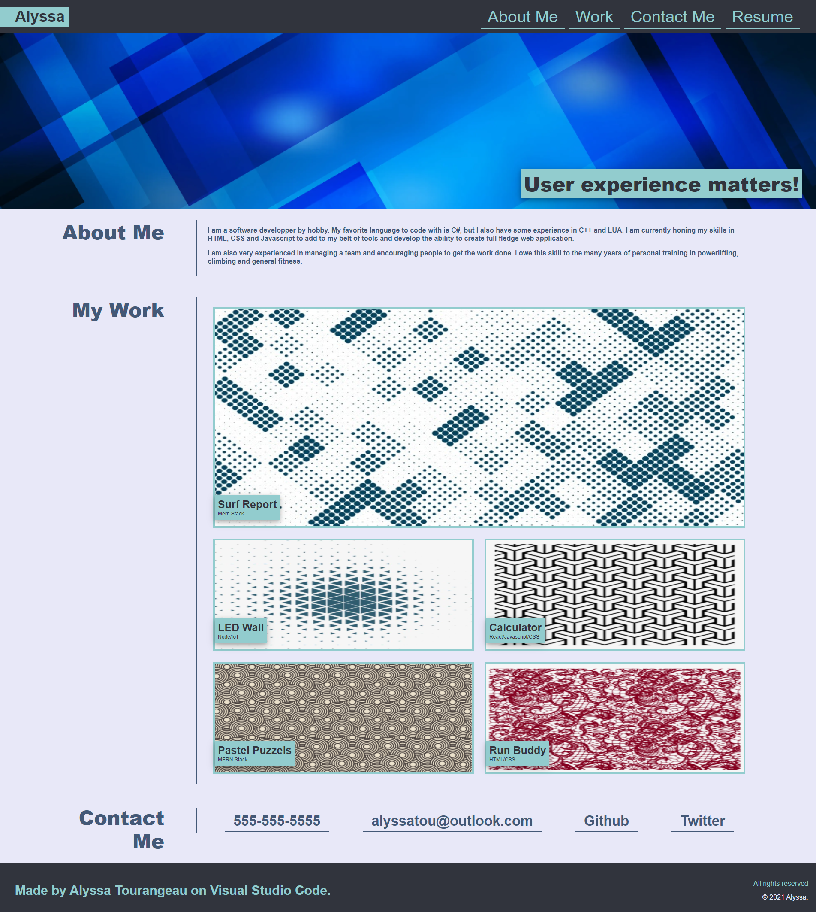
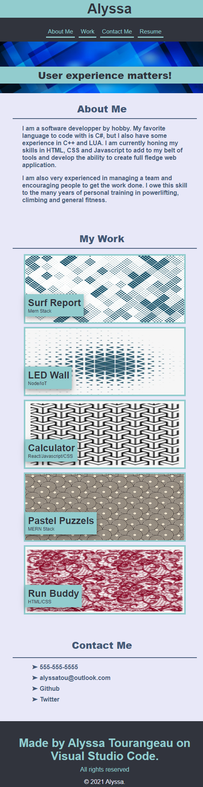
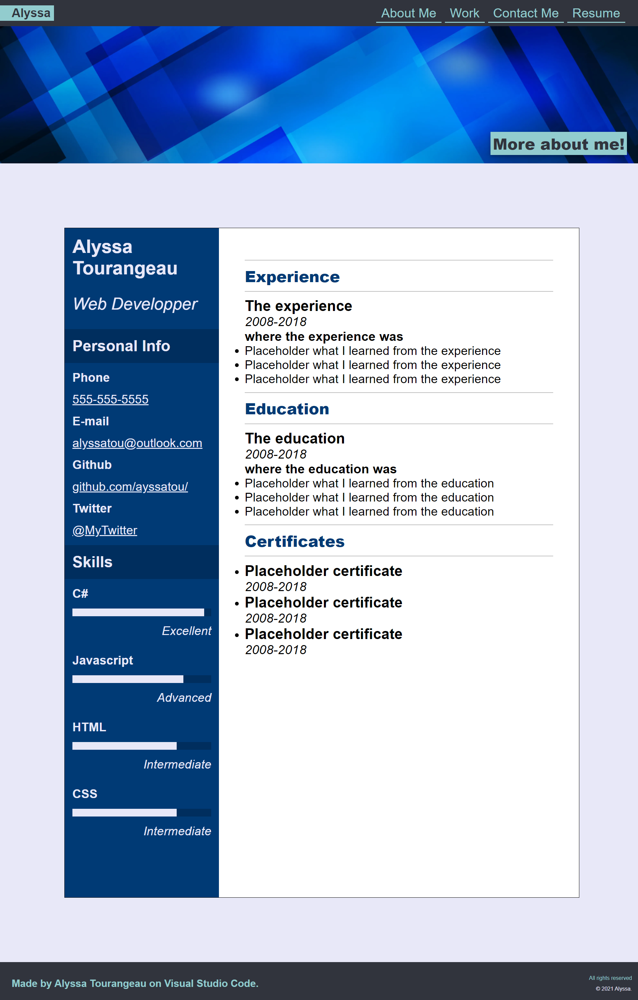

<h1>Alyssa Portfolio</h1>

 It is a website representing me Portfolio and my resume as Web developper. 

<h1> Content </h1>

This project is composed of 2 HTML files and 1 CSS file 

<ul>
<li><a href="index.html"> index.html </a>
This is the portfolio page
</li>
<li><a href="resume.html"> resume.html </a>
This is the resume page
</li>
<li><a href="assets/css/style.css"> assets/css/style.css </a></li>
</ul>

 At the moment most of the content is composed of Placeholders, but they will be filled eventually. 

<h1>Screenshots</h1>

The Portfolio page

The Portfolio page on mobile

The resume page

